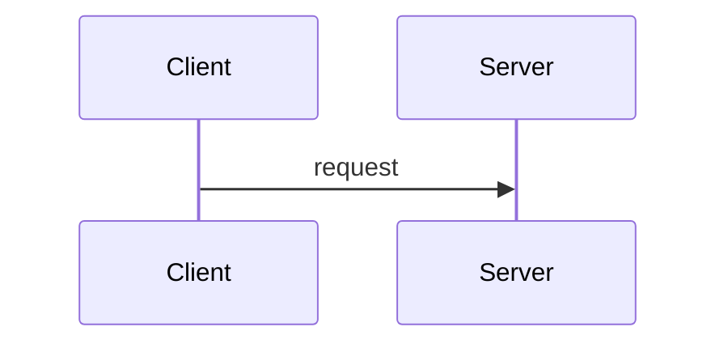

# Publication Syntax — MD ↔ Confluence Storage Format Mapping Spec

> **Purpose**: keep Markdown canonical as the single source of truth and deterministically,
> idempotently convert it to Confluence Storage Format (XHTML). This document is the
> bidirectional spec SSoT for `scripts/md_to_storage.py` (MD→XML) and
> `scripts/storage_to_md.py` (XML→MD).
>
> **Version**: 1.0 (Phase 1 / Option A foundation)
> **Prerequisite policy**: direct editing of Confluence pages is forbidden — the canonical
> copy is the repo MD.

---

## 1. Scope

| Applies | Doesn't apply |
|---|---|
| Body of `Planning-Agent-Hub/PROJECTS/{product}/**/*.draft.md` | `orange-pm-plugin/skills/**/SKILL.md` (skill definitions) |
| `templates/standard/**/*.md` (Phase 2) | `CONTEXT/**/*.md` (operational metadata) |
| `reports/render/*.complete.md` on publish | general README/comments |

→ This spec applies **only to publication-targeted MD**. General MD is unaffected.

## 2. Frontmatter — publication metadata

```yaml
---
# Standard publication metadata (publication whitelist)
title: "[Policy Definition] {{PRODUCT_NAME}}"
wo_id: G2-C-POL-001
type: policy            # requirements | policy | screen | meetings | research | etc
layer: C                # B (common) | C (product) | DIRECT (Track B/C single)
version: 1.2
last_updated: 2026-05-30

publication:
  # Info macro at the top of the page (optional — not generated if absent)
  header:
    style: info         # info | warning | note | tip
    body: |
      **This document is the service policy definition for {{PRODUCT_NAME}}.**

      doc_id: {{DOC_ID}} version: {{VERSION}} last updated: {{DATE}}

  # Meta area (optional — not generated if absent)
  meta:
    layout: two_equal   # single | two_equal | three_equal
    cells:
      - panel:
          title: "Reference Materials"
          body: |
            **Related documents**
            - [[page:[Requirements Definition] {{PRODUCT_NAME}}]]
            - [[page:[Screen Design Spec] {{PRODUCT_NAME}}]]
      - panel:
          title: "Table of Contents"
          body: |
            ::: {.expand title="Table of Contents"}
            {{toc}}
            :::
      - change_history: 3

  # Color-cycling state (activated in Phase 3 — placeholder in the current Phase 1)
  color_state: null

# (below, free-form general frontmatter area)
---
```

**Whitelist (fields passed through to publication)**: `title`, `wo_id`, `type`, `layer`,
`version`, `last_updated`, `publication`.
**All other fields**: removed by the prefilter (e.g. authoring metadata·self-verification·
prohibited items, etc.).

## 3. Block macros — fenced div syntax

Uses Pandoc-compatible fenced div syntax:

### 3.1 Panel (section container)

```markdown
::: {.panel section="§1 Policy Overview"}
## §1 Policy Overview

### §1-1 Purpose

| Item | Content |
|---|---|
| **Purpose** | the purpose of this policy document |
:::
```

→ XML output:
```xml
<ac:layout-section ac:type="single"><ac:layout-cell>
  <ac:structured-macro ac:name="panel" ac:schema-version="1">
    <ac:parameter ac:name="borderColor">#24FE00</ac:parameter>
    <ac:parameter ac:name="titleColor">#002FD5</ac:parameter>
    <ac:parameter ac:name="titleBGColor">24FE00</ac:parameter>
    <ac:parameter ac:name="borderStyle">none</ac:parameter>
    <ac:parameter ac:name="title">§1 Policy Overview</ac:parameter>
    <ac:rich-text-body>
      <h2>§1 Policy Overview</h2><hr/>
      <h3>§1-1 Purpose</h3>
      <table>...</table>
    </ac:rich-text-body>
  </ac:structured-macro>
</ac:layout-cell></ac:layout-section>
<!-- spacer -->
<ac:layout-section ac:type="single"><ac:layout-cell><p><br/></p></ac:layout-cell></ac:layout-section>
```

**Default panel style (applied automatically if omitted)**:
- `borderColor=#24FE00`, `titleColor=#002FD5`, `titleBGColor=24FE00`, `borderStyle=none`
- This spec = the internal company standard (aligned with `render_verify F1` validation)

**Style variants (attribute override)**:
```markdown
::: {.panel section="TBD item" style="tbd"}      # red border (TBD emphasis)
::: {.panel section="Common" style="common"}      # default (can be omitted)
::: {.panel section="Product" style="product"}    # blue border
::: {.panel section="Review" style="warning"}     # warning emphasis
```

Full style mapping table:

| style value | borderColor | titleColor | titleBGColor | Meaning |
|---|---|---|---|---|
| `common` (default) | `#24FE00` | `#002FD5` | `24FE00` | common/product policy standard |
| `product` | `#0050E5` | `#FFFFFF` | `0050E5` | product-specific emphasis |
| `tbd` | `#FF4D4F` | `#FFFFFF` | `FF4D4F` | TBD/needs review |
| `warning` | `#FAAD14` | `#FFFFFF` | `FAAD14` | warning |
| `info` | `#1890FF` | `#FFFFFF` | `1890FF` | informational |

### 3.2 Info/Warning/Note/Tip (simple callouts)

```markdown
::: {.info}
A general informational message
:::

::: {.warning}
A caution
:::

::: {.note}
A reference note
:::

::: {.tip}
A tip
:::
```

→ XML:
```xml
<ac:structured-macro ac:name="info" ac:schema-version="1">
  <ac:rich-text-body><p>A general informational message</p></ac:rich-text-body>
</ac:structured-macro>
```

(`name` maps directly from the fenced div class name — info|warning|note|tip)

### 3.3 Expand (collapsible region)

```markdown
::: {.expand title="Detailed Change History"}
- 2026-05-01: initial draft
- 2026-05-15: pricing policy reflected
:::
```

→ XML:
```xml
<ac:structured-macro ac:name="expand" ac:schema-version="1">
  <ac:parameter ac:name="title">Detailed Change History</ac:parameter>
  <ac:rich-text-body>
    <ul><li>2026-05-01: initial draft</li><li>2026-05-15: pricing policy reflected</li></ul>
  </ac:rich-text-body>
</ac:structured-macro>
```

### 3.4 Mermaid / PlantUML (code-block fence)

```markdown

```

→ XML: currently handled as a plain code block (no Confluence macro used, text preserved
only).
Post-Phase 2, a `<ac:structured-macro ac:name="mermaid">` macro conversion option is planned.

### 3.5 Code Block (general)

```markdown
```python
def foo():
    pass
```
```

→ XML:
```xml
<ac:structured-macro ac:name="code" ac:schema-version="1">
  <ac:parameter ac:name="language">python</ac:parameter>
  <ac:plain-text-body><![CDATA[def foo():
    pass]]></ac:plain-text-body>
</ac:structured-macro>
```

**Rules**:
- Only `<ac:plain-text-body>` + CDATA are allowed (aligned with `render_verify F2`
  validation)
- The language fence info-string maps to `ac:parameter ac:name="language"`
- The `language` parameter is omitted if no language is specified

## 4. Inline macros

### 4.1 Page link

```markdown
[[page:[Requirements Definition] DBaaS]]
```

→ XML:
```xml
<ac:link><ri:page ri:content-title="[Requirements Definition] DBaaS"/></ac:link>
```

### 4.2 User mention (reserved for expansion)

```markdown
[[user:hong]]
```

→ Activated in Phase 4. Not implemented in the current Phase 1.

### 4.3 Automatic macros (frontmatter-triggered)

| MD notation | XML output | Trigger |
|---|---|---|
| `{{toc}}` | `<ac:structured-macro ac:name="toc"/>` | body, or frontmatter `publication.meta.cells[].panel.body` |
| `{{change_history N}}` | `<ac:structured-macro ac:name="change-history"><ac:parameter ac:name="limit">N</ac:parameter></ac:structured-macro>` | same |
| `{{PRODUCT_NAME}}`, `{{DOC_ID}}`, `{{VERSION}}`, `{{DATE}}` | passed through as plain text (placeholder) | handled in a separate substitution step |

## 5. Standard elements (direct mapping)

| MD | XML | Notes |
|---|---|---|
| `# H1` | `<h1>` | avoid where possible (duplicates the page title) |
| `## H2` | `<h2>` | matches the panel `section` attribute |
| `### H3` | `<h3>` | |
| `**bold**` | `<strong>` | |
| `*italic*` | `<em>` | |
| lists | `<ul>/<ol>/<li>` | |
| `\| table \|` | `<table class="relative-table wrapped">` + colgroup | column width inferred (even distribution or based on first-row text length) |
| `[text](url)` | `<a href="url">text</a>` | external link |
| `---` | `<hr/>` | |
| blank line | `<p><br/></p>` | spacer |
| `> blockquote` | `<blockquote>` | |

### 5.1 Table column widths

```markdown
| Item | Content |
|---|---|
| **Purpose** | the purpose of this policy document |
```

→ Default: even distribution (`<col style="width: 50%;"/>` × 2).

**Explicit column widths (HTML comment directive)**:
```markdown
<!-- col-widths: 15%, 85% -->
| Item | Content |
|---|---|
| Purpose | ... |
```

→ Applies the specified widths to the XML colgroup.

Default class: `relative-table wrapped`. Width: 90% (overall table width, not per-column).

### 5.2 Emphasis — `**strong**` vs `<strong>`

MD `**...**` always becomes `<strong>`. When inline color is needed (Phase 3 color
cycling), use a fenced span — see section 4.

## 6. Color Spans (Phase 3)

> **Status (as of 2026-06-06)**:
> - Converter (md_to_storage / storage_to_md): ✓ active (Phase 1B/1C/1D, span
>   bidirectional).
> - Automatic cycling engine (`apply_color_cycling.py` + `diff_blocks.py` + meta.json
>   `_color_state`): ✓ **implemented and tested** (apply_color_cycling_test 14/14 PASS —
>   diff→region→span injection→change-summary panel→state serialization).
> - Render pipeline wiring: ✓ **wired into /render step 6-1-A2 as an optional step**
>   (`--color-cycle` flag). Off by default — cycling is applied right before publish only
>   when explicitly specified (no color change unless specified). Also works via a
>   standalone CLI call.

### 6.1 MD ↔ XML notation

```markdown
[changed text]{.color-green}
[previously changed text]{.color-blue}
regular text
```

→ XML:
```xml
<span style="color: rgb(0,176,80)">changed text</span>
<span style="color: rgb(0,80,229)">previously changed text</span>
regular text
```

**Color codes**:
- `.color-green` → `#00B050` (rgb 0,176,80) — most recent change
- `.color-blue` → `#0050E5` (rgb 0,80,229) — previous change
- Default (no span) → black

**Forbidden**:
- Applying spans inside code blocks (CDATA — the XML parser won't recognize them)
- Applying spans to macro parameter values
- Nested spans (`[a [b]{.color-green}]{.color-blue}`) — lint L6 FAIL

### 6.2 Automatic cycling model (2-cycle decay)

Colors fade by one stage each publish round:

| Publish Round | New changed region (G_N) | Previous changed region (B_N) | Remainder |
|---|---|---|---|
| **N=1 first draft** | — | — | **all black** |
| **N=2 first change** | diff(v1, v2) → green | ∅ | black |
| **N=3** | diff(v2, v3) → green | G_{N-1} \ G_N → blue | black |
| **N=k (k≥3)** | diff(v_{k-1}, v_k) → green | G_{k-1} \ G_k → blue | black (G_{k-2} expired) |

→ Automatically expires after exactly 2 cycles — prevents runaway color accumulation.

### 6.3 Block-level diff

Color-applied regions are **block-level** (avoiding word/line-level noise):

| Block type | Unit | Notes |
|---|---|---|
| Paragraph | 1 paragraph = 1 region | most common |
| List item | 1 list item = 1 region | nested lists use a nested path |
| Table | **cell-level** region | row-level is too coarse |
| Heading | 1 heading (when text changes) | triggers a path update |
| Code block | **entire block** = 1 region | CDATA — no internal splitting |
| Macro body (panel/info) | internal paragraph-level | nested |

Region identifier = a `(logical path, block_hash)` tuple. Example:
`§3 Policy/Pricing/§3.1 Standard Rate/<p[2]>`.

### 6.4 `meta.json._color_state` schema

Color-cycling state is stored per deliverable in `meta.json`:

```json
{
  "id": "12345",
  "_sync": { ... },
  "_color_state": {
    "publish_round": 7,
    "previous_source_hash": "sha256:...",
    "previous_green_regions": [
      {"path": "§3 Policy/Pricing/<p[2]>", "block_hash": "abc123..."},
      {"path": "§5 Operations/SLA",         "block_hash": "def456..."}
    ],
    "baseline": false
  }
}
```

| Field | Type | Meaning |
|---|---|---|
| `publish_round` | int | cumulative publish count (0=before first draft) |
| `previous_source_hash` | str\|null | MD source hash at the last publish (for drift verification) |
| `previous_green_regions` | list[Region] | green regions from the last publish (blue candidates this time) |
| `baseline` | bool | if true, colors are reset (next publish treated as N=1) |

`baseline: true` triggers on:
- A new page (publish_round=0)
- Manual `/render --color-reset` call (Phase 3G)
- New baseline set after REMOTE-DRIFT handling (apply-inbox)

### 6.5 Change summary panel (Phase 3F)

Automatically inserted at the top of the page on every publish:

```markdown
::: {.panel section="This change summary (v_N)"}
- Added: §3.2 new pricing plan (green)
- Modified: §5.1 SLA retention period (green), §7 IAM permission table 2 cells (green)
- Previous round's (v_{N-1}) changes: shown in blue
- Removed: §4.3 deprecated
:::
```

Supplements readability + colorblind accessibility beyond color alone.

### 6.6 D4 meeting-minutes special cycling (Phase 3H)

Meeting minutes are cumulative, so handled differently from normal cycling:

- New meeting item added → green (the entire panel)
- Existing meeting body modified → normal cycling applies (cell/paragraph-level)
- The timestamp itself is a change indicator — blue/green accumulation carries less meaning,
  so it auto-expires quickly

## 7. Automatic layout policy

Automatically generated even when the MD doesn't specify layout structure:

```
[frontmatter.publication.header]  → <ac:layout-section single> + info macro
[frontmatter.publication.meta]    → <ac:layout-section {layout}> + cells

Each ::: {.panel} block in the MD body   → <ac:layout-section single> + cell + panel
                                            + spacer layout-section (panel spacing)

::: {.info|warning|...} in the MD body   → direct (no layout wrapper, within the body flow)
```

**Rules**:
1. Panel blocks are always wrapped in their own `layout-section` + `cell`
2. Automatic spacers are inserted between panels
3. Info/Warning etc. simple callouts are placed in the body without a layout wrapper
4. Frontmatter's `publication.header`/`meta` is prepended before the MD body starts

## 8. Round-trip guarantees

`md_to_storage.py` → `storage_to_md.py` → guaranteed identical to the original MD (after
normalization):

| Guarantee | Notes |
|---|---|
| ✓ 100% body text | whitespace/line breaks are normalized (multiple spaces inside a block → single) |
| ✓ Tables (cell text, column count) | column-width directive preserved only when explicitly specified |
| ✓ Code blocks (language, body) | indentation preserved exactly |
| ✓ Panel (section, style) | default style is omitted on round-trip |
| ✓ Info/Warning/Note/Tip | name matches exactly |
| ✓ Expand (title, body) | |
| ✓ Page links | content-title matches exactly |
| ✓ Frontmatter publication fields | whitelist only |
| △ Color spans (Phase 3) | guaranteed in Phase 3 |
| ✗ Page ID/version | exists only in metadata, not in the body |
| ✗ User-defined macros edited directly in Confluence | policy: direct editing forbidden |

## 9. Conversion determinism

| Aspect | Guarantee |
|---|---|
| Same MD input → same byte-for-byte XML output | ✓ (hash comparable) |
| XML output normalization | 2-space indent, alphabetically sorted attributes, self-closing empty elements |
| Idempotence | `md_to_storage(storage_to_md(X)) == X` (after normalization) |
| Time/random dependence | none (DATE etc. placeholders are substituted in a separate step) |

## 10. Validation gate (publication-lint)

`scripts/lint_publication_syntax.py` (newly added in Phase 1 1H) validates the following:

| Rule | Level | Notes |
|---|---|---|
| Fenced div class is in the allow-list (`panel`/`info`/`warning`/`note`/`tip`/`expand`) | FAIL | |
| Panel `section` attribute required | FAIL | |
| Panel `style` value is a permitted mapping | FAIL | |
| Code block language fence (known language, if specified) | WARN | |
| Automatic macro `{{...}}` unresolved placeholder | WARN | DATE etc. are substituted at publish time |
| Nested color span | FAIL | active in Phase 3 |
| Table column-count consistency (header vs body rows) | FAIL | |

## 11. Integration with existing systems

| Existing component | Role after Phase 1 |
|---|---|
| `render_assemble.py` | unchanged — inlines MD master content (pre-conversion step) |
| `publication_prefilter.py` | unchanged — removes process metadata (MD stage) |
| `fact_preservation_check.py` | unchanged — LLM normalization safety net |
| `render_verify.py` F1/F2 | **moved to the MD stage** — restructured as fenced-div attribute validation |
| `render_verify.py` W1/W2/W3 | unchanged (MD body regex validation) |
| `render_sync_check.py` `_strip_storage_xml` | **integrated into `storage_to_md.py`** (~200 LOC saved) |
| `render_apply_inbox.py` | unchanged — keeps the merge-proposal apply flow |
| `templates/confluence-xml/*.xml` | **gradually retired** — one-time migration to `templates/standard/*.md` (Phase 1F) |
| `meta.json` | unchanged — tracks page_id/last_published_version. Adds `_color_state` in Phase 3 |

## 12. Converter entry points (implementation interface)

### `scripts/md_to_storage.py`

```bash
python md_to_storage.py \
  --input reports/render/{WO_ID}.complete.md \
  --output /tmp/{WO_ID}.storage.xml \
  [--style-substitute]  # substitute placeholders like {{PRODUCT_NAME}} (publication stage only)
  [--validate]          # automatically call publication-lint after conversion
```

Exit codes:
- `0` success
- `1` MD parse failure
- `2` Lint FAIL
- `3` I/O error

### `scripts/storage_to_md.py`

```bash
python storage_to_md.py \
  --input snapshot.xml \
  --output /tmp/snapshot.md \
  [--strip-colors]      # remove Phase 3 color spans (restore clean MD, for diffing)
```

Exit codes:
- `0` success
- `1` XML parse failure
- `2` unsupported macro found (warns, then preserves the text)

## 13. Not yet implemented / future expansion

- Mermaid/PlantUML macro conversion (currently text-preservation only)
- Image attachment upload (Phase 4, for Track B/C screen design specs)
- User mentions `[[user:...]]` (Phase 4)
- Confluence widget macros (jira-issue, gliffy, etc. — unused)

## 14. Change history

| Version | Date | Change |
|---|---|---|
| 1.0 | 2026-05-30 | Phase 1 draft — established the MD↔XML bidirectional spec SSoT |
