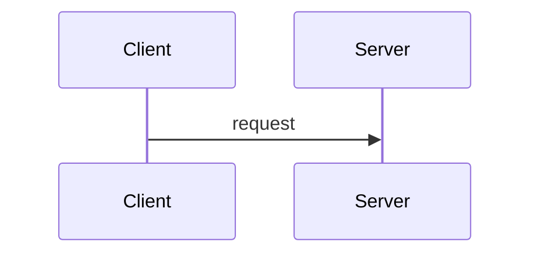

# Publication Syntax — MD ↔ Confluence Storage Format 매핑 사양

> **목적**: Markdown 정본을 single source of truth로 두고, Confluence Storage Format(XHTML)으로 결정적·멱등 변환한다. 본 문서는 `scripts/md_to_storage.py`(MD→XML)와 `scripts/storage_to_md.py`(XML→MD)의 양방향 사양 SSoT다.
>
> **버전**: 1.0 (Phase 1 / Option A 토대)
> **선행 정책**: Confluence 페이지 직접 편집 금지 — 정본은 repo MD.

---

## 1. 적용 범위

| 적용 | 비적용 |
|---|---|
| `Planning-Agent-Hub/PROJECTS/{product}/**/*.draft.md` 본문 | `orange-pm-plugin/skills/**/SKILL.md` (스킬 정의) |
| `templates/standard/**/*.md` (Phase 2) | `CONTEXT/**/*.md` (운영 메타) |
| `reports/render/*.complete.md` 발행 시 | 일반 README/주석 |

→ 본 사양은 **publication-targeted MD**에만 적용. 일반 MD는 영향 없음.

## 2. 프론트매터 — 발행 메타

```yaml
---
# 표준 발행 메타 (publication 화이트리스트)
title: "[정책정의서] {{PRODUCT_NAME}}"
wo_id: G2-C-POL-001
type: policy            # requirements | policy | screen | meetings | research | etc
layer: C                # B (공통) | C (제품) | DIRECT (Track B/C 단일)
version: 1.2
last_updated: 2026-05-30

publication:
  # 페이지 상단 info macro (선택 — 없으면 미생성)
  header:
    style: info         # info | warning | note | tip
    body: |
      **본 문서는 {{PRODUCT_NAME}}의 서비스 정책 정의서다.**

      doc_id: {{DOC_ID}} 버전: {{VERSION}} 최종 수정: {{DATE}}

  # Meta 영역 (선택 — 없으면 미생성)
  meta:
    layout: two_equal   # single | two_equal | three_equal
    cells:
      - panel:
          title: "참고 자료"
          body: |
            **관련 문서**
            - [[page:[요구사항 정의서] {{PRODUCT_NAME}}]]
            - [[page:[화면설계서] {{PRODUCT_NAME}}]]
      - panel:
          title: "목차"
          body: |
            ::: {.expand title="목차"}
            {{toc}}
            :::
      - change_history: 3

  # 색상 cycling 상태 (Phase 3에서 활성화 — 현 Phase 1은 placeholder)
  color_state: null

# (이하 일반 frontmatter 자유 영역)
---
```

**화이트리스트 (publication에 전달되는 필드)**: `title`, `wo_id`, `type`, `layer`, `version`, `last_updated`, `publication`.
**그 외 필드**: prefilter에서 제거됨 (예: 작성 메타·자기검증·금지사항 등).

## 3. 블록 매크로 — Fenced Div 문법

Pandoc 호환 fenced div 문법 사용:

### 3.1 Panel (섹션 컨테이너)

```markdown
::: {.panel section="§1 정책 개요"}
## §1 정책 개요

### §1-1 목적

| 항목 | 내용 |
|---|---|
| **목적** | 본 정책서의 목적 |
:::
```

→ XML 출력:
```xml
<ac:layout-section ac:type="single"><ac:layout-cell>
  <ac:structured-macro ac:name="panel" ac:schema-version="1">
    <ac:parameter ac:name="borderColor">#24FE00</ac:parameter>
    <ac:parameter ac:name="titleColor">#002FD5</ac:parameter>
    <ac:parameter ac:name="titleBGColor">24FE00</ac:parameter>
    <ac:parameter ac:name="borderStyle">none</ac:parameter>
    <ac:parameter ac:name="title">§1 정책 개요</ac:parameter>
    <ac:rich-text-body>
      <h2>§1 정책 개요</h2><hr/>
      <h3>§1-1 목적</h3>
      <table>...</table>
    </ac:rich-text-body>
  </ac:structured-macro>
</ac:layout-cell></ac:layout-section>
<!-- spacer -->
<ac:layout-section ac:type="single"><ac:layout-cell><p><br/></p></ac:layout-cell></ac:layout-section>
```

**Panel 기본 스타일 (생략 시 자동 적용)**:
- `borderColor=#24FE00`, `titleColor=#002FD5`, `titleBGColor=24FE00`, `borderStyle=none`
- 본 사양 = 사내 표준 (`render_verify F1` 검증과 정합)

**스타일 변형 (attribute override)**:
```markdown
::: {.panel section="TBD 항목" style="tbd"}      # 빨강 border (TBD 강조)
::: {.panel section="공통" style="common"}        # 기본 (생략 가능)
::: {.panel section="제품" style="product"}       # 파랑 border
::: {.panel section="검토" style="warning"}       # 주의 강조
```

style 매핑 표 (전체):

| style 값 | borderColor | titleColor | titleBGColor | 의미 |
|---|---|---|---|---|
| `common` (기본) | `#24FE00` | `#002FD5` | `24FE00` | 공통/제품 정책 표준 |
| `product` | `#0050E5` | `#FFFFFF` | `0050E5` | 제품 고유 강조 |
| `tbd` | `#FF4D4F` | `#FFFFFF` | `FF4D4F` | TBD/검토 필요 |
| `warning` | `#FAAD14` | `#FFFFFF` | `FAAD14` | 경고 |
| `info` | `#1890FF` | `#FFFFFF` | `1890FF` | 정보성 |

### 3.2 Info/Warning/Note/Tip (단순 콜아웃)

```markdown
::: {.info}
일반 정보성 메시지
:::

::: {.warning}
주의 사항
:::

::: {.note}
참고 메모
:::

::: {.tip}
팁
:::
```

→ XML:
```xml
<ac:structured-macro ac:name="info" ac:schema-version="1">
  <ac:rich-text-body><p>일반 정보성 메시지</p></ac:rich-text-body>
</ac:structured-macro>
```

(`name`은 fenced div 클래스명 그대로 매핑 — info|warning|note|tip)

### 3.3 Expand (접이식 영역)

```markdown
::: {.expand title="상세 변경 이력"}
- 2026-05-01: 초안
- 2026-05-15: 가격 정책 반영
:::
```

→ XML:
```xml
<ac:structured-macro ac:name="expand" ac:schema-version="1">
  <ac:parameter ac:name="title">상세 변경 이력</ac:parameter>
  <ac:rich-text-body>
    <ul><li>2026-05-01: 초안</li><li>2026-05-15: 가격 정책 반영</li></ul>
  </ac:rich-text-body>
</ac:structured-macro>
```

### 3.4 Mermaid / PlantUML (코드블록 fence)

```markdown

```

→ XML: 현재는 일반 code block으로 처리(Confluence 매크로 미사용, 텍스트 보존만).
Phase 2 이후 `<ac:structured-macro ac:name="mermaid">` 매크로 변환 옵션 추가 예정.

### 3.5 Code Block (일반)

```markdown
```python
def foo():
    pass
```
```

→ XML:
```xml
<ac:structured-macro ac:name="code" ac:schema-version="1">
  <ac:parameter ac:name="language">python</ac:parameter>
  <ac:plain-text-body><![CDATA[def foo():
    pass]]></ac:plain-text-body>
</ac:structured-macro>
```

**규칙**:
- `<ac:plain-text-body>` + CDATA만 허용 (`render_verify F2` 검증과 정합)
- 언어 fence info-string은 `ac:parameter ac:name="language"`로 매핑
- 언어 미지정 시 `language` 파라미터 생략

## 4. 인라인 매크로

### 4.1 페이지 링크

```markdown
[[page:[요구사항 정의서] DBaaS]]
```

→ XML:
```xml
<ac:link><ri:page ri:content-title="[요구사항 정의서] DBaaS"/></ac:link>
```

### 4.2 사용자 멘션 (확장 예약)

```markdown
[[user:hong]]
```

→ Phase 4에서 활성. 현 Phase 1은 미구현.

### 4.3 자동 매크로 (frontmatter 트리거)

| MD 표기 | XML 출력 | 트리거 |
|---|---|---|
| `{{toc}}` | `<ac:structured-macro ac:name="toc"/>` | 본문 또는 frontmatter `publication.meta.cells[].panel.body` |
| `{{change_history N}}` | `<ac:structured-macro ac:name="change-history"><ac:parameter ac:name="limit">N</ac:parameter></ac:structured-macro>` | 동일 |
| `{{PRODUCT_NAME}}`, `{{DOC_ID}}`, `{{VERSION}}`, `{{DATE}}` | 그대로 텍스트로 (placeholder) | 별도 치환 단계에서 처리 |

## 5. 표준 요소 (직접 매핑)

| MD | XML | 비고 |
|---|---|---|
| `# H1` | `<h1>` | 가급적 사용 안 함 (페이지 제목과 중복) |
| `## H2` | `<h2>` | Panel `section` 속성과 일치시킴 |
| `### H3` | `<h3>` | |
| `**bold**` | `<strong>` | |
| `*italic*` | `<em>` | |
| `리스트` | `<ul>/<ol>/<li>` | |
| `\| 표 \|` | `<table class="relative-table wrapped">` + colgroup | 컬럼 너비는 추론 (균등 또는 첫 행 텍스트 길이 기반) |
| `[text](url)` | `<a href="url">text</a>` | 외부 링크 |
| `---` | `<hr/>` | |
| 빈 줄 | `<p><br/></p>` | spacer |
| `> blockquote` | `<blockquote>` | |

### 5.1 표 컬럼 너비

```markdown
| 항목 | 내용 |
|---|---|
| **목적** | 본 정책서의 목적 |
```

→ 기본: 균등 분배 (`<col style="width: 50%;"/>` × 2).

**컬럼 너비 명시 (HTML 주석 directive)**:
```markdown
<!-- col-widths: 15%, 85% -->
| 항목 | 내용 |
|---|---|
| 목적 | ... |
```

→ XML colgroup에 명시된 너비 적용.

기본 클래스: `relative-table wrapped`. 너비: 90% (테이블 폭, 컬럼별이 아닌 전체).

### 5.2 강조 표시 — `**strong**` vs `<strong>`

MD `**...**`은 항상 `<strong>`. 인라인 색상이 필요한 경우(Phase 3 색상 cycling)는 fenced span 사용 — 4절 참고.

## 6. 색상 Span (Phase 3)

> **상태 (2026-06-06 기준)**:
> - 변환기 (md_to_storage / storage_to_md): ✓ 활성 (Phase 1B/1C/1D, span 양방향)
> - 자동 cycling 엔진 (`apply_color_cycling.py` + `diff_blocks.py` + meta.json
>   `_color_state`): ✓ **구현·테스트 완료** (apply_color_cycling_test 14/14 PASS —
>   diff→region→span 주입→변경요약 패널→state 직렬화).
> - render 파이프라인 배선: ✓ **/render 단계 6-1-A2 에 옵션 단계로 배선** (`--color-cycle`
>   플래그). 기본 off — 명시 시에만 publish 직전 cycling 적용(미지정 시 색상 변화 없음).
>   단독 CLI 호출로도 동작.

### 6.1 MD ↔ XML 표기

```markdown
[변경된 텍스트]{.color-green}
[직전 변경 텍스트]{.color-blue}
일반 텍스트
```

→ XML:
```xml
<span style="color: rgb(0,176,80)">변경된 텍스트</span>
<span style="color: rgb(0,80,229)">직전 변경 텍스트</span>
일반 텍스트
```

**색상 코드**:
- `.color-green` → `#00B050` (rgb 0,176,80) — 최신 변경
- `.color-blue` → `#0050E5` (rgb 0,80,229) — 직전 변경
- 기본 (span 없음) → 검정

**금지**:
- 코드블록 내부 span 적용 (CDATA — XML 파서가 인식 안 함)
- 매크로 파라미터 값에 span 적용
- nested span (`[a [b]{.color-green}]{.color-blue}`) — lint L6 FAIL

### 6.2 자동 Cycling 모델 (2-cycle decay)

각 publish 라운드마다 색상이 한 단계씩 사라짐:

| Publish Round | 새 변경 영역 (G_N) | 이전 변경 영역 (B_N) | 나머지 |
|---|---|---|---|
| **N=1 첫 작성** | — | — | **모두 검정** |
| **N=2 첫 변경** | diff(v1, v2) → 초록 | ∅ | 검정 |
| **N=3** | diff(v2, v3) → 초록 | G_{N-1} \ G_N → 파랑 | 검정 |
| **N=k (k≥3)** | diff(v_{k-1}, v_k) → 초록 | G_{k-1} \ G_k → 파랑 | 검정 (G_{k-2} 만료) |

→ 정확히 2-cycle 후 자동 만료 — 색상 누적 폭주 방지.

### 6.3 Block 단위 Diff

색상 적용 region 은 **block 단위** (단어/라인 단위 노이즈 회피):

| Block 종류 | 단위 | 비고 |
|---|---|---|
| Paragraph | 문단 1개 = region 1 | 가장 흔함 |
| List item | 리스트 항목 1개 = region 1 | 중첩 리스트는 nested path |
| Table | **셀 단위** region | 행 단위는 too coarse |
| Heading | 제목 1개 (텍스트 변경 시) | path 갱신 트리거 |
| Code block | **block 전체** = region 1 | CDATA — 내부 분할 X |
| Macro body (panel/info) | 내부 paragraph 단위 | nested |

Region 식별자 = `(논리 경로, block_hash)` 튜플. 예: `§3 정책/요금제/§3.1 표준요금/<p[2]>`.

### 6.4 `meta.json._color_state` 스키마

색상 cycling 상태는 deliverable 별 `meta.json` 에 저장:

```json
{
  "id": "12345",
  "_sync": { ... },
  "_color_state": {
    "publish_round": 7,
    "previous_source_hash": "sha256:...",
    "previous_green_regions": [
      {"path": "§3 정책/요금제/<p[2]>", "block_hash": "abc123..."},
      {"path": "§5 운영/SLA",           "block_hash": "def456..."}
    ],
    "baseline": false
  }
}
```

| 필드 | 타입 | 의미 |
|---|---|---|
| `publish_round` | int | 누적 publish 횟수 (0=첫 작성 전) |
| `previous_source_hash` | str\|null | 직전 publish 시 MD source 해시 (drift 검증용) |
| `previous_green_regions` | list[Region] | 직전 publish 의 초록 region (이번에 파랑 후보) |
| `baseline` | bool | true 면 색상 리셋 (다음 publish 를 N=1 로 처리) |

`baseline: true` 트리거:
- 신규 페이지 (publish_round=0)
- `/render --color-reset` 수동 호출 (Phase 3G)
- REMOTE-DRIFT 처리 후 신규 baseline 설정 (apply-inbox)

### 6.5 변경 요약 패널 (Phase 3F)

매 publish 마다 페이지 최상단에 자동 삽입:

```markdown
::: {.panel section="이번 변경 요약 (v_N)"}
- 추가: §3.2 신규 요금제 (초록)
- 수정: §5.1 SLA 보존기간 (초록), §7 IAM 권한 표 2개 셀 (초록)
- 직전 라운드(v_{N-1}) 변경분: 파랑으로 표기
- 삭제: §4.3 폐기됨
:::
```

색상만으로 부족한 가독성 + 색맹 접근성 보강.

### 6.6 D4 회의록 특수 cycling (Phase 3H)

회의록은 누적형이라 일반 cycling 과 다르게 처리:

- 신규 회의 항목 추가 → 초록 (해당 panel 전체)
- 기존 회의 본문 수정 → 일반 cycling 적용 (셀/문단 단위)
- 시간 표시 자체가 변화 지표 → blue/green 누적이 의미 약해 자동 만료 빠름

## 7. 자동 Layout 정책

MD에서 layout 구조를 명시하지 않아도 자동 생성:

```
[frontmatter.publication.header]  → <ac:layout-section single> + info macro
[frontmatter.publication.meta]    → <ac:layout-section {layout}> + cells

MD 본문의 각 ::: {.panel} 블록   → <ac:layout-section single> + cell + panel
                                  + spacer layout-section (panel 간격)

MD 본문의 ::: {.info|warning|...}  → 직접 (layout 래퍼 없음, 본문 흐름 안)
```

**규칙**:
1. Panel 블록은 항상 자체 `layout-section` + `cell`로 감쌈
2. Panel 사이에 자동 spacer 삽입
3. Info/Warning 등 단순 콜아웃은 layout 래퍼 없이 본문에 배치
4. Frontmatter의 `publication.header`/`meta`는 MD 본문 시작 전 prepend

## 8. Round-Trip 보장 항목

`md_to_storage.py` → `storage_to_md.py` → 원본 MD 동일성 보장 (정규화 후):

| 보장 | 비고 |
|---|---|
| ✓ 본문 텍스트 100% | 공백/줄바꿈은 정규화 (블록 내부 다중 공백 → 단일) |
| ✓ 표 (셀 텍스트, 컬럼 수) | 컬럼 너비 directive는 명시했을 때만 보존 |
| ✓ 코드블록 (언어, 본문) | 들여쓰기 정확히 보존 |
| ✓ Panel (section, style) | 기본 style은 round-trip 시 생략 |
| ✓ Info/Warning/Note/Tip | name 정확히 일치 |
| ✓ Expand (title, body) | |
| ✓ 페이지 링크 | content-title 정확히 일치 |
| ✓ Frontmatter publication 필드 | 화이트리스트만 |
| △ 색상 span (Phase 3) | Phase 3에서 보장 |
| ✗ 페이지 ID/version | 메타에만 존재, 본문 X |
| ✗ Confluence 직접 편집된 사용자 정의 매크로 | 정책: 직접 편집 금지 |

## 9. 변환 결정성 (Determinism)

| 측면 | 보장 |
|---|---|
| 동일 MD 입력 → 동일 바이트 XML 출력 | ✓ (해시 비교 가능) |
| XML 출력 정규화 | 들여쓰기 2칸, 속성 알파벳 순, 빈 요소 self-closing |
| 멱등성 | `md_to_storage(storage_to_md(X)) == X` (정규화 후) |
| 시간/난수 의존 | 없음 (DATE 등 placeholder는 별도 단계에서 치환) |

## 10. 검증 게이트 (publication-lint)

`scripts/lint_publication_syntax.py` (Phase 1 1H로 신설) 가 다음을 검증:

| 규칙 | 수준 | 비고 |
|---|---|---|
| Fenced div 클래스가 허용 목록 (`panel`/`info`/`warning`/`note`/`tip`/`expand`) | FAIL | |
| Panel `section` 속성 필수 | FAIL | |
| Panel `style` 값이 허용 매핑 | FAIL | |
| 코드블록 언어 fence (지정 시 알려진 언어) | WARN | |
| 자동 매크로 `{{...}}` 미해결 placeholder | WARN | DATE 등은 발행 시 치환되므로 |
| 색상 span nested | FAIL | Phase 3 시 활성 |
| 표 컬럼 수 일관성 (헤더와 본문 행) | FAIL | |

## 11. 기존 시스템 통합

| 기존 컴포넌트 | Phase 1 후 역할 |
|---|---|
| `render_assemble.py` | 그대로 — MD master 인라인 전개 (변환 전 단계) |
| `publication_prefilter.py` | 그대로 — process metadata 제거 (MD 단계) |
| `fact_preservation_check.py` | 그대로 — LLM 정규화 안전망 |
| `render_verify.py` F1/F2 | **MD 단계로 이전** — fenced div 어트리뷰트 검증으로 재구성 |
| `render_verify.py` W1/W2/W3 | 그대로 (MD 본문 정규식 검증) |
| `render_sync_check.py` `_strip_storage_xml` | **`storage_to_md.py`로 통합** (~200 LOC 절감) |
| `render_apply_inbox.py` | 그대로 — merge-proposal 적용 흐름 유지 |
| `templates/confluence-xml/*.xml` | **점진 폐기** — `templates/standard/*.md` 로 1회 마이그레이션 (Phase 1F) |
| `meta.json` | 그대로 — page_id/last_published_version 추적. Phase 3에서 `_color_state` 추가 |

## 12. 변환기 진입점 (구현 인터페이스)

### `scripts/md_to_storage.py`

```bash
python md_to_storage.py \
  --input reports/render/{WO_ID}.complete.md \
  --output /tmp/{WO_ID}.storage.xml \
  [--style-substitute]  # {{PRODUCT_NAME}} 등 placeholder 치환 (publication 단계에서만)
  [--validate]          # 변환 후 publication-lint 자동 호출
```

종료 코드:
- `0` 성공
- `1` MD 파싱 실패
- `2` Lint FAIL
- `3` I/O 오류

### `scripts/storage_to_md.py`

```bash
python storage_to_md.py \
  --input snapshot.xml \
  --output /tmp/snapshot.md \
  [--strip-colors]      # Phase 3 색상 span 제거 (clean MD 복원, diff용)
```

종료 코드:
- `0` 성공
- `1` XML 파싱 실패
- `2` 미지원 매크로 발견 (경고 후 텍스트 보존)

## 13. 미구현 / 미래 확장

- Mermaid/PlantUML 매크로 변환 (현재는 텍스트 보존만)
- 이미지 첨부 업로드 (Phase 4 Track B/C 화면설계서용)
- 사용자 멘션 `[[user:...]]` (Phase 4)
- Confluence 위젯 매크로 (jira-issue, gliffy 등 — 미사용)

## 14. 변경 이력

| 버전 | 일자 | 변경 |
|---|---|---|
| 1.0 | 2026-05-30 | Phase 1 초안 — MD↔XML 양방향 사양 SSoT 수립 |
